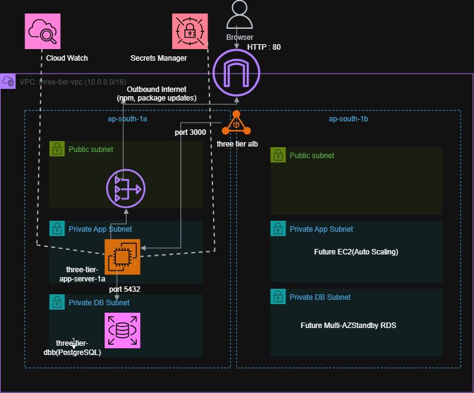
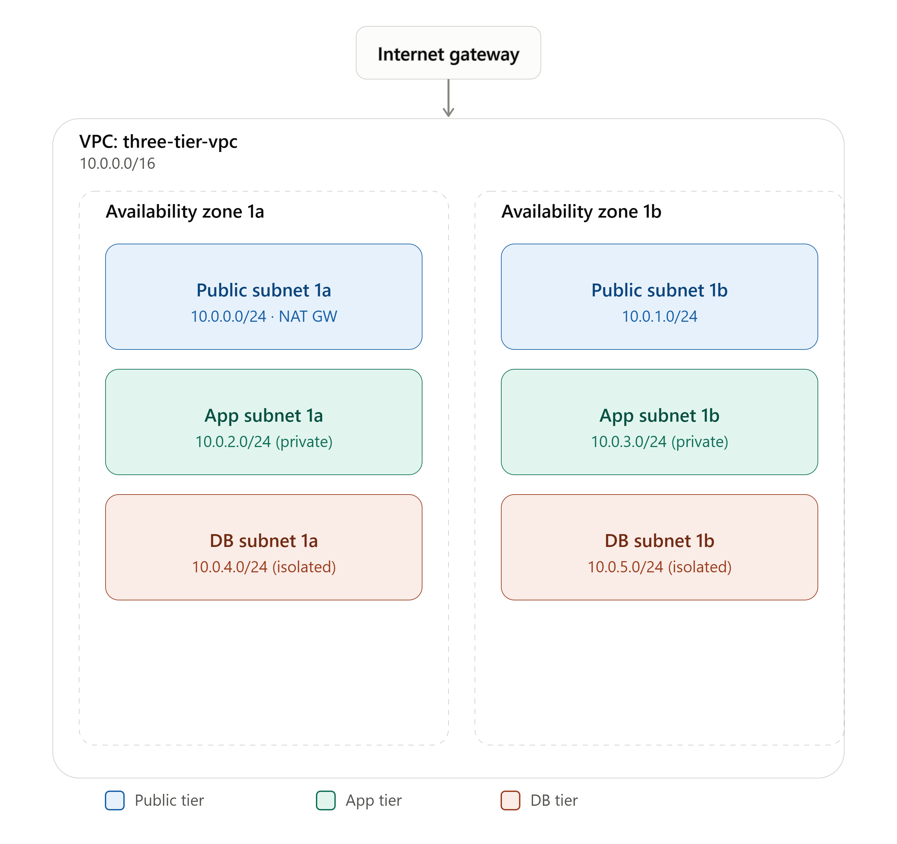
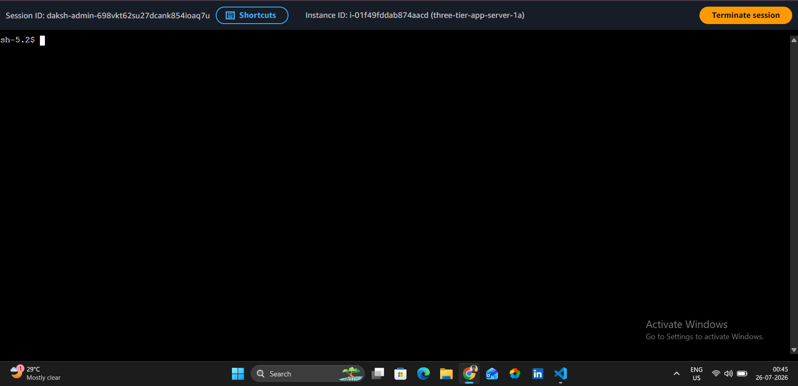
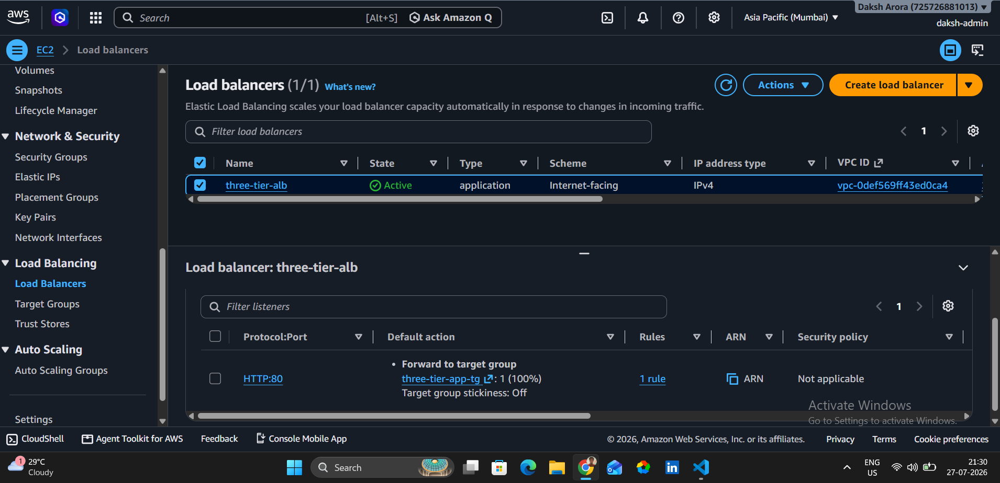
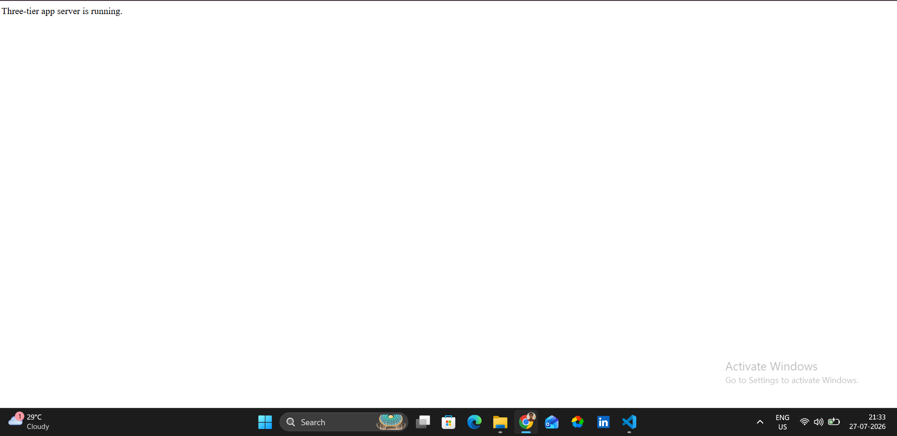
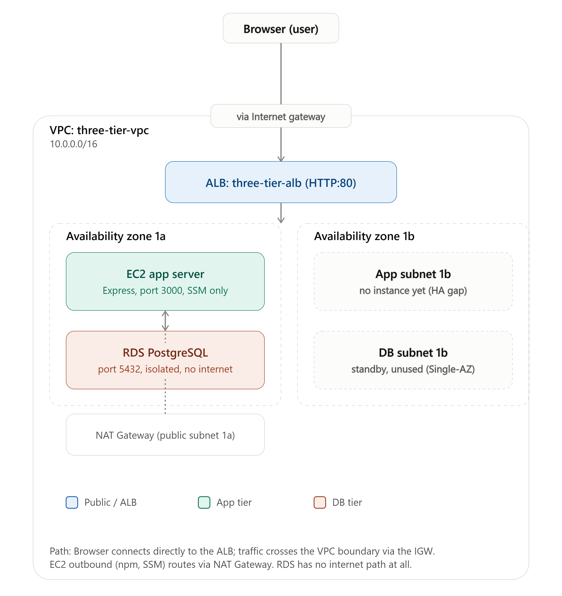
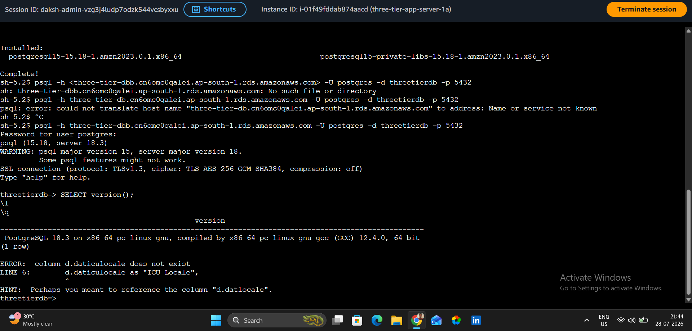
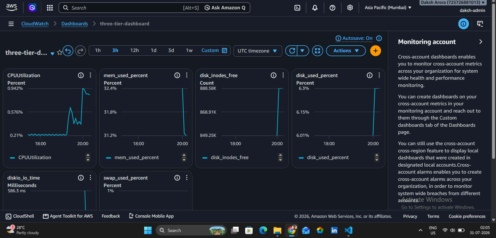
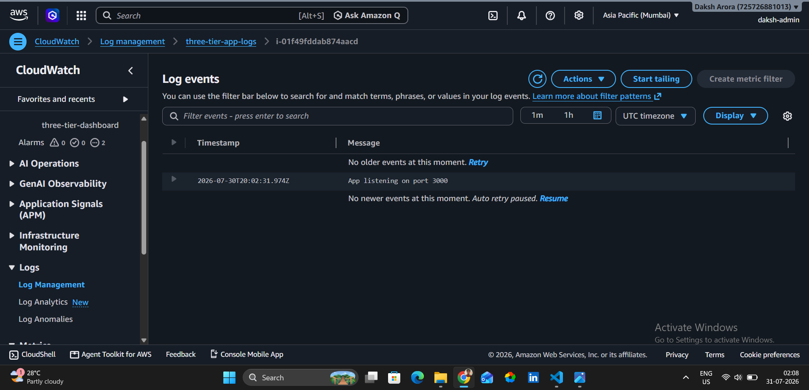

# AWS Three Tier Web Application

## Project Goal

Deploy a production-style three-tier web application on AWS.

## Networking

- VPC
- Public Subnets
- Private App Subnets
- Private DB Subnets
- Internet Gateway
- NAT Gateway
- Route Tables

## Architecture

<p align="center">
  
</p>

> **Note**
> This project implements a cost-optimized deployment due to AWS student credit limits. While the network spans two Availability Zones, only one EC2 instance and one Single-AZ Amazon RDS instance are currently deployed. The remaining subnets are intentionally reserved for future Auto Scaling and Multi-AZ expansion.

## Features

- Custom VPC spanning two Availability Zones
- Public and private subnet architecture
- Private EC2 application server
- Application Load Balancer
- Amazon RDS PostgreSQL
- AWS Systems Manager Session Manager (SSH-less administration)
- AWS Secrets Manager
- Amazon CloudWatch Logs & Metrics
- CloudWatch Dashboard
- IAM least-privilege hardening

## Implementation Journey

### ✅ Day 1 – Account Foundations
- Locked down the AWS root user with MFA; created a dedicated IAM admin user for daily work
- Discovered that admin access alone doesn't grant billing visibility — enabled 
  "IAM User and Role Access to Billing Information" at the account level
- Configured an AWS Budget with actual-cost and forecasted-cost alert thresholds
  before provisioning any resources

## Cost Management

- Configured AWS Budgets with 50% actual-cost and 80% forecasted-cost alert thresholds.
- Optimized the deployment for cost by using a Single-AZ RDS instance and a single NAT Gateway while staying within the available AWS student credits.
- Documented production-scale alternatives in the Future Improvements section.

### ✅ Day 2 – Networking
- Created a custom VPC
- Created public, application and database subnets across two Availability Zones
- Attached an Internet Gateway
- Configured public and private route tables
- Deployed a NAT Gateway for outbound internet access from private subnets

<p align="center">
  
</p>

### ✅ Day 3 – Security & Compute
- Created Security Groups for ALB, Application and Database tiers
- Configured Security Group communication (ALB → App → Database)
- Created an IAM Role with `AmazonSSMManagedInstanceCore`
- Launched an Amazon Linux 2023 EC2 instance in a private application subnet
- Disabled public IP assignment
- Connected securely using AWS Systems Manager Session Manager without SSH or a key pair

<p align="center">
  
</p>

### ✅ Day 4 – Application Tier

### Completed
- Built a simple Express.js application.
- Added a `/health` endpoint for future ALB health checks.
- Deployed the application on a private EC2 instance.
- Installed Node.js using `nvm`.
- Configured the application as a `systemd` service.
- Enabled automatic startup on instance boot.
- Verified the service survives terminal disconnects and instance reboots.

### Key Learnings
- Difference between foreground processes and Linux services.
- How `systemd` manages long-running applications.
- Why `ExecStart` requires the absolute Node.js path when using `nvm`.
- Difference between `systemctl start` and `systemctl enable`.
- Why production applications should run as services instead of terminal processes.

### ✅ Day 5 – Load Balancing

### Completed
- Created an Application Load Balancer (ALB).
- Created a Target Group for the application tier.
- Configured the ALB listener on HTTP (port 80).
- Registered the private EC2 instance as a target on port 3000.
- Configured `/health` as the Target Group health check endpoint.
- Successfully served the Express application through the ALB DNS name.
- Kept the application server private while exposing only the ALB to the Internet.

<p align="center">
  
</p>

### Key Learnings
- Difference between an ALB listener port and the backend application port.
- How an ALB creates a new connection to backend targets instead of forwarding the client's TCP connection directly.
- Why the ALB must reside in public subnets while application servers remain in private subnets.
- Purpose of Target Groups and health checks.
- Why browsers access the ALB on HTTP (80) while the Express application listens on port 3000.

<p align="center">
  
</p>

### ✅ Day 6 – Database Tier

## Architecture

The project currently implements a production-inspired three-tier architecture on AWS. The networking spans two Availability Zones, while the application and database currently run in a cost-optimized single-instance configuration. The unused subnets are intentionally retained to support future migration to Auto Scaling and Multi-AZ deployments.

<p align="center">
  
</p>

### Current Request Flow

1. User sends an HTTP request.
2. Application Load Balancer receives the request.
3. ALB forwards it to the private EC2 instance.
4. The Express application queries Amazon RDS PostgreSQL over port 5432.
5. The database returns the result to the application.
6. The application sends the response back through the ALB to the user.

<p align="center">
  
</p>


## ✅ Day 7 – Monitoring & Observability

### Completed

- Installed the Amazon CloudWatch Agent on the private EC2 instance.
- Configured the agent to collect host-level metrics including memory, disk usage, and swap usage.
- Redirected the Express application's stdout and stderr to a dedicated log file using `systemd`.
- Configured the CloudWatch Agent to continuously ship application logs to Amazon CloudWatch Logs.
- Verified successful log ingestion using a dedicated CloudWatch Log Group and per-instance Log Stream.
- Created a CloudWatch Dashboard to visualize infrastructure and database metrics from a single view.

<p align="center">
  
</p>

<p align="center">
  
</p>

### Key Learnings

- Difference between CloudWatch Logs and CloudWatch Metrics.
- Why EC2 requires the CloudWatch Agent to expose memory and disk metrics.
- Difference between default EC2 monitoring and host-level monitoring.
- How `systemd` logging integrates with CloudWatch Agent.
- Why RDS exposes database metrics without installing an agent.
- Basic observability pipeline for production applications.
- Importance of following the principle of least privilege for IAM users.
- Difference between broad administrative access and service-specific IAM permissions.

### Monitoring Pipeline

```text
Express Application
        │
 console.log()
        │
        ▼
systemd
        │
        ▼
/var/log/three-tier-app/app.log
        │
        ▼
CloudWatch Agent
   ┌──────────────┴──────────────┐
   ▼                             ▼
CloudWatch Logs          CloudWatch Metrics
(Application Logs)   (Memory, Disk, Swap)
```


## Future Improvements

The current implementation intentionally uses a single EC2 instance and single-AZ database deployment to remain within AWS student credit limits.

Future production enhancements include:

- Auto Scaling Group across multiple Availability Zones
- Multi-instance application deployment
- Centralized CloudWatch Agent configuration using AWS Systems Manager Parameter Store
- CloudWatch Alarms with Amazon SNS notifications
- HTTPS using AWS Certificate Manager
- Infrastructure as Code using Terraform
- CI/CD pipeline with GitHub Actions

### ✅ Day 8 – IAM Hardening

After completing the monitoring setup, the IAM permissions for the `daksh-admin` user were reviewed and hardened.

- Removed the broad `AdministratorAccess` policy.
- Replaced it with service-specific AWS managed policies required for this project.
- Verified continued access to EC2, VPC, RDS, CloudWatch, Secrets Manager, Session Manager, and the Application Load Balancer.

This reduced unnecessary administrative privileges while maintaining full functionality for the deployed infrastructure.

### Note

This implementation focuses on establishing the monitoring foundation for the application by collecting infrastructure metrics and centralizing application logs.

Advanced observability features such as CloudWatch Alarms, SNS notifications, custom dashboards, log insights, and automated alerting are intentionally planned for a future dedicated monitoring and observability project.